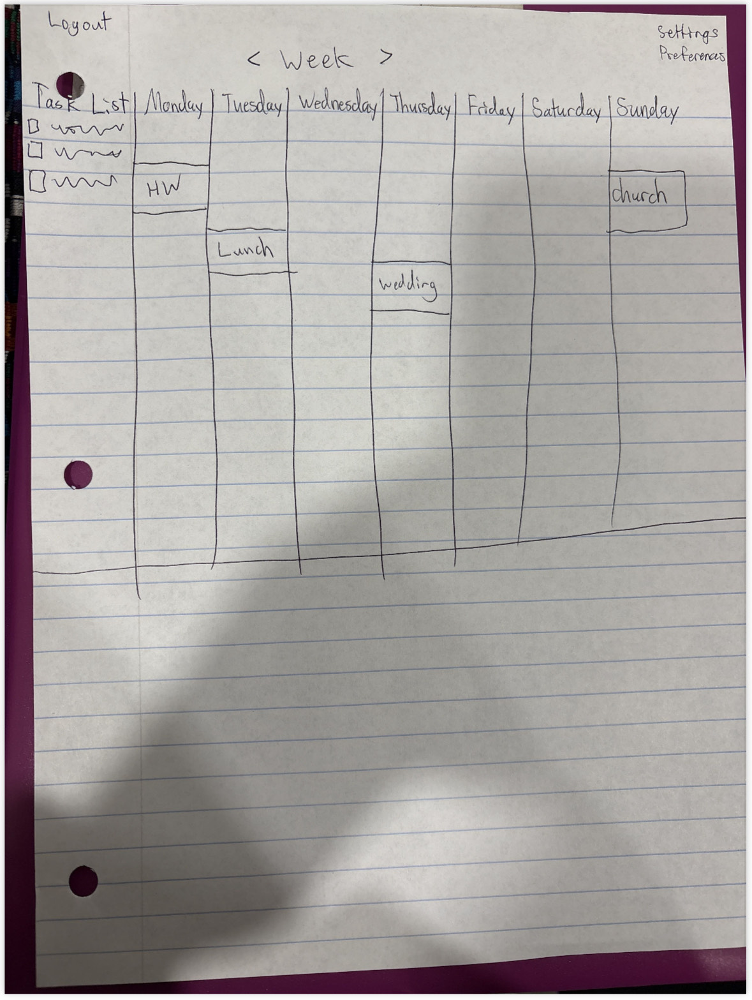

# CS260
Scheduler Website made for the CS260 class I took in 2026
The goal of this repository is to contain all the code needed for my website

The instructions said to modify this file again, so here it is!

Elevator Pitch:
    I get sick of planning my day on planners that require too much info. You have to put in dates, exact times, why, repeating, etc. It get's exhausting, and honestly I sometimes just want to put in that I plan on working on x for an hour at this time and follow that with another hour doing something else. I plan on creating a scheduling app that is super simple and easy to use, with an interface that allows you to easily scroll between days, have a task list on the side if you want, and that you can grab and move events as easily as left clicking rather then having to manually change every peice of info in a planning block. This would also include sharable goals to other users and would allow you to see other people's public goals.

HTML - This will be used for the login page as well as the website structure in the following page

CSS - This will include different colors and the ability to grab a block of plans and move it (this including that the block will be dragged with your cursor)

React - Is needed for the website to react to the persons inputs, allows them to login so they have their own account, etc. 

Web service - We would go with registering the users, saving color preferences, etc. 

Database: Also stores the color options as well as the plans you saved so when you come back they are still there. 

WebSocket: As you change your tasks it will change it on the page thing that shows all the other peoples tasks or goals from others. 

Added stuff during the HTML project portion! **********

Overall I would say I have put everything in except for the simon Html being deployed to my website. I didn't understand how to do that when I later deployed the website html that I made. So It isn't there. The other prerequisites I did. 

I have the readme here, and my github repository listed on the website on each page

I use the tags for html, have multiple pages, use images, use a login system, have tables for info, links between pages, link for API outsourced thing, and a websocket spot or placeholder. I also have the additional things listed below. 

HTML - I have four html pages, the about page doesn't have much, but the other three are fleshed out. 
Links - I have a navigation thing that has links to all pages. 
Texts - Textual content describing the app and its features*****
Images - Added placeholder images for when I put actual ones there later. ****
Login - Login form with username etc
Data base - You have the data of goals and schedules in a database
Websocket - Real time changing of goals on the shared board. 
3rd Party service- the motivational quote is the api external thing.

CSS:

-I could not for the life of me figure out how to deploy the simon thing to my website, so unfortunately I have not done that. But I have completed the other prerequisites. 

-Made the website look good, I like the colors and think they look nice and the text bubble things that contain the elements look good in my opinion as well. 

-I used flex as a CSS framework. 

-I used CSS for all the visual components

-I modified it so it would look good on other devices etc. 

-I will have imported a font by the next commit

-I used quite a few elements, including ID and pseudo. 

React things I added/did:

-I made my website a single page application instead of a multipage website. 
-I bundled everything using Vite
-I made a bunch of react components for all the html css, etc files.
-I made the react router
-I deployed the simon thing and did all of the above to the simon-css folder and it's contents. 
-I commited with comments to my repository which is on my website. 

-- I didn't realize I could commit until I was almost done with doing this for the simon-css portion, so I didnt commit too much for that***

2/26/2026
-- Added multiple react components onto every page except about (there was nowhere to put it on that page)
-- Put in things like being able to set goals, a place for other peoples goals to go
-- Put in fake scripts that kind of mimic live feed for the time being
-- For some reason I needed to fix the deployment stuff, which idk if that was in the insturctions but that was super difficult XD
-- The goals should function and show below as well as login and creating an account
-- they are all mocks but they should be functional!